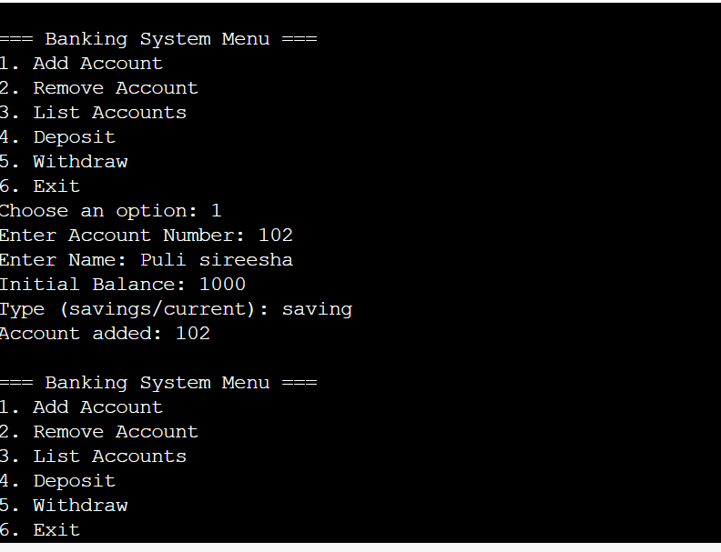

📘 Banking System – Java Console Application
🔧 Description
This is a simple console-based Banking System implemented in Java. It supports:

Account creation (Savings/Current)

Deposit and Withdraw operations

Listing and Removing accounts

Admin-level account management

🧑‍💻 Features
Account Types: Savings and Current

Admin Operations: Add, Remove, List Accounts

User Operations: Deposit and Withdraw

Overdraft Support: Only for Current accounts (₹1000 limit)

📸 Sample Output

🏗️ How it Works
Admin can add new accounts by specifying:

Account Number

Holder Name

Initial Balance

Account Type (Savings or Current)

Deposits and withdrawals can be made based on account number.

All accounts can be listed or removed by admin.

📂 File Structure
bash
Copy
Edit
BankingSystem/
├── Main.java          # Entry point and menu handling
├── BankAccount.java   # Abstract class for account structure
├── SavingsAccount.java
├── CurrentAccount.java
├── Admin.java         # Admin logic (add/remove/find/list)
└── README.md          # Project documentation
🛠️ Technologies Used
Language: Java

Environment: Console
▶️ How to Run
Compile the program:
javac Main.java
Run the compiled program:
java Main
📌 Notes
Overdraft is only available for current accounts.

Savings accounts require sufficient balance for withdrawals.

Input is handled using Scanner and ArrayList for dynamic account storage.

output:

